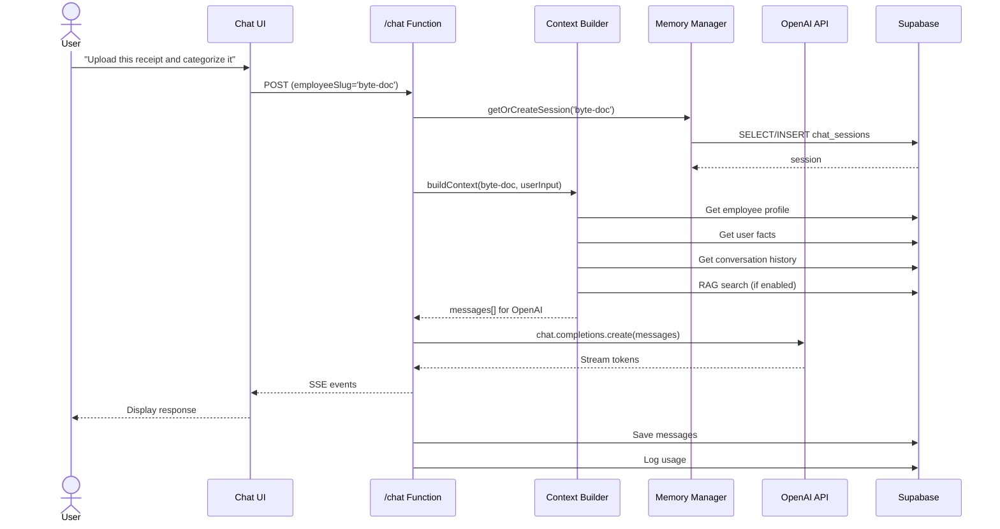
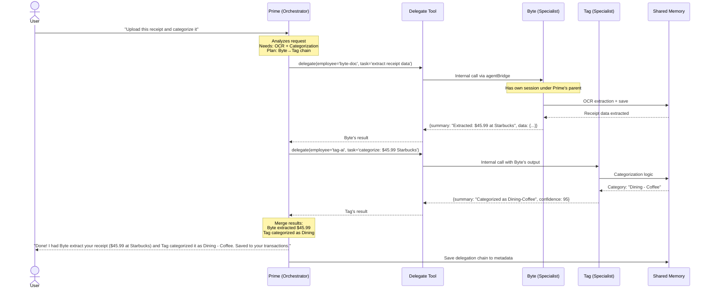

# 🕸️ Agent Network Architecture

**Status**: Design Document  
**Date**: 2025-10-09  
**Purpose**: Multi-agent collaboration with Prime as orchestrator

---

## 📖 Current Single-Agent Architecture

### How It Works Today

**User→Employee→OpenAI→Database** (Linear Flow)

1. User sends message to a specific employee (e.g., Byte)
2. Frontend posts to `/.netlify/functions/chat`
3. Function builds context from memory/RAG
4. Single OpenAI call for that employee
5. Response streams back to user
6. Message saved to database

**No cross-employee collaboration** - each employee works in isolation.

### Current Flow Diagram



**Problem**: Byte can't hand off to Tag for categorization. User must manually switch employees.

---

## 🚀 Proposed Multi-Agent Architecture

### Vision

**Prime as Planner/Dispatcher** → Delegates to specialists → Aggregates results

1. User talks to Prime (always)
2. Prime decides: answer directly OR delegate to 1-3 specialists
3. Specialists work independently (with their own memory/context)
4. Results return to Prime
5. Prime merges and presents unified response

**Benefits**:
- ✅ Single conversation thread (user only talks to Prime)
- ✅ Specialists collaborate automatically
- ✅ Each employee maintains expertise and memory
- ✅ User gets best answer regardless of routing

### Proposed Flow Diagram



---

## 🔄 Detailed Flow: Single vs Multi-Agent

### Scenario: "Analyze my receipts and suggest tax deductions"

#### Current (Single-Agent)

```
User → Byte (manually selected)
  Byte: "I can extract receipts but I'm not a tax expert. Try Ledger."
User → Ledger (manually switches)
  Ledger: "I can suggest deductions but I need the receipts. Upload them to Byte first."
User → [frustrated, gives up]
```

**Problems**:
- 🔴 User does all the orchestration
- 🔴 Context lost between employees
- 🔴 Poor UX, high friction

#### Proposed (Multi-Agent)

```
User → Prime: "Analyze my receipts and suggest tax deductions"

Prime [internal decision]:
  1. Need receipts → delegate to Byte
  2. Need tax analysis → delegate to Ledger  
  3. Coordinate: Byte first, then Ledger with Byte's output

Prime → Byte: "Extract all receipt data"
  Byte → Returns: [{date, merchant, amount, category}, ...]

Prime → Ledger: "Analyze these receipts for deductions: [Byte's data]"
  Ledger → Returns: "Found $450 in deductible office supplies"

Prime → User: "I had Byte analyze your receipts and Ledger review them for tax purposes. You have $450 in deductible expenses! Here's the breakdown..."
```

**Benefits**:
- ✅ Single conversation
- ✅ Automatic orchestration
- ✅ Context preserved
- ✅ Seamless UX

---

## 📨 Inter-Agent Protocol

### Request Envelope

```json
{
  "request_id": "550e8400-e29b-41d4-a716-446655440000",
  "origin_employee": "prime-boss",
  "target_employee": "byte-doc",
  "user_id": "anon-123456",
  "parent_session_id": "prime's-session-uuid",
  "child_session_id": null,
  "objective": "Extract receipt data from uploaded image",
  "input": "User uploaded receipt.jpg - extract amount, merchant, date",
  "constraints": {
    "max_tokens": 1200,
    "max_depth": 2,
    "deadline_ms": 15000
  },
  "context_hints": ["receipt", "ocr"],
  "handoff_data": {
    "facts": ["User prefers detailed extraction"],
    "references": [
      {
        "owner_scope": "receipt",
        "source_id": "file-abc123"
      }
    ]
  }
}
```

### Response Envelope

```json
{
  "request_id": "550e8400-e29b-41d4-a716-446655440000",
  "target_employee": "byte-doc",
  "summary": "Extracted receipt: $45.99 at Starbucks on 2025-10-09",
  "result": "I successfully extracted all data from the receipt. Found a purchase of $45.99 at Starbucks on October 9th, 2025. The receipt appears to be for coffee and pastry.",
  "artifacts": [
    {
      "type": "json",
      "value": {
        "amount": 45.99,
        "merchant": "Starbucks",
        "date": "2025-10-09",
        "items": ["Coffee", "Pastry"]
      }
    }
  ],
  "new_facts": ["User frequently visits Starbucks"],
  "used_sources": [
    {
      "owner_scope": "receipt",
      "source_id": "file-abc123"
    }
  ],
  "token_usage": {
    "prompt": 234,
    "completion": 156,
    "total": 390
  }
}
```

---

## 🛡️ Safety Mechanisms

### 1. Depth Limiting

**Max depth**: 2 levels

```
User → Prime (depth 0)
  ├→ Byte (depth 1)
  │   └→ BLOCKED (depth 2 limit)
  └→ Tag (depth 1)
      └→ BLOCKED (depth 2 limit)
```

**Enforcement**:
```typescript
if (request.current_depth >= MAX_DEPTH) {
  return {
    error: "Maximum delegation depth reached",
    suggestion: "Return to Prime with current results"
  };
}
```

### 2. Fan-Out Limiting

**Max concurrent delegates**: 3

```
Prime → [Byte, Tag, Ledger]  ✅ Allowed (3 employees)
Prime → [Byte, Tag, Ledger, Crystal]  ❌ Blocked (4 > max)
```

### 3. Cycle Detection

Track `(origin, target, objective)` tuples:

```typescript
const delegationKey = `${origin}→${target}:${hashObjective(objective)}`;

if (seenDelegations.has(delegationKey)) {
  return { error: "Cycle detected - delegation loop prevented" };
}

seenDelegations.add(delegationKey);
```

### 4. Timeout Protection

**Per-delegate timeout**: 15 seconds

```typescript
const result = await Promise.race([
  agentBridge.call(targetEmployee, input),
  timeout(15000)
]);
```

### 5. Token Budget

**Budget per delegation**: 1200 tokens

```typescript
if (estimatedTokens > constraints.max_tokens) {
  return {
    error: "Token budget exceeded",
    suggestion: "Simplify request or increase budget"
  };
}
```

---

## 🧠 Shared Memory Model

### Per-Employee Sessions

Each employee gets their own session, linked to Prime's parent session:

```sql
CREATE TABLE chat_sessions (
  id UUID PRIMARY KEY,
  user_id TEXT,
  employee_slug TEXT,
  parent_session_id UUID,  -- Links to Prime's session
  ...
);
```

**Example**:
```
Prime's session: uuid-111
  ├→ Byte's child session: uuid-222 (parent_session_id = uuid-111)
  └→ Tag's child session: uuid-333 (parent_session_id = uuid-111)
```

### Memory Scope

**Global facts** (scope='global'):
- Available to ALL employees
- "User prefers weekly budgets"

**Employee-specific facts** (scope='byte-doc'):
- Only for that employee
- "User uploads high-res scans"

**Domain facts** (scope='tax'):
- Shared across domain
- "User is self-employed in Canada"

### Context Assembly for Delegated Calls

```typescript
function buildDelegatedContext(request: DelegationRequest) {
  return {
    // 1. Base system prompt
    system: BASE_PROMPT,
    
    // 2. Employee's own prompt
    employee: getEmployee(request.target_employee).system_prompt,
    
    // 3. Global + employee-specific facts
    facts: [...globalFacts, ...employeeFacts],
    
    // 4. Objective from Prime
    objective: request.objective,
    
    // 5. Handoff data (from Prime)
    context: request.handoff_data,
    
    // 6. Employee's own session history
    history: getRecentMessages(childSessionId, limit=5),
    
    // 7. User's input
    input: request.input
  };
}
```

---

## 🔀 Delegation Patterns

### Pattern 1: Sequential Chain

```
User: "Process this receipt and file it"
Prime → Byte (extract) → Tag (categorize) → Prime (confirm)
```

```typescript
// Prime's delegation logic
const byteResult = await delegate('byte-doc', 'Extract receipt data');
const tagResult = await delegate('tag-ai', `Categorize: ${byteResult.data}`);
return merge(byteResult, tagResult);
```

### Pattern 2: Parallel Fan-Out

```
User: "Analyze my spending and suggest improvements"
Prime → [Crystal, Tag, Ledger] (parallel) → Prime (aggregate)
```

```typescript
const [crystal, tag, ledger] = await Promise.all([
  delegate('crystal-analytics', 'Analyze spending patterns'),
  delegate('tag-ai', 'Review categorization accuracy'),
  delegate('ledger-tax', 'Identify deductible expenses')
]);

return synthesize([crystal, tag, ledger]);
```

### Pattern 3: Conditional Delegation

```
User: "Help me with my finances"
Prime: [analyzes] → needs more info OR delegates
```

```typescript
if (needsSpecialist(userInput)) {
  const specialist = selectBest(userInput);
  return await delegate(specialist, userInput);
} else {
  return answerDirectly(userInput);
}
```

---

## 📊 Memory Sharing Between Employees

### Shared Resources

All employees can access:
- ✅ `user_memory_facts` (scope='global' or employee-specific)
- ✅ `memory_embeddings` (user-scoped)
- ✅ `chat_session_summaries` (if parent session has one)

### Delegation-Specific Context

Prime can pass context to specialists:

```json
{
  "handoff_data": {
    "facts": [
      "User prefers CSV exports",
      "Canadian tax rules apply"
    ],
    "references": [
      {"owner_scope": "receipt", "source_id": "receipt-001"},
      {"owner_scope": "bank-statement", "source_id": "stmt-october"}
    ],
    "constraints": {
      "format": "concise",
      "max_tokens": 800
    }
  }
}
```

Byte receives this in its context and can:
- Read the facts
- Access the referenced documents via RAG
- Respect constraints

### Child Sessions

When Prime delegates to Byte:

```sql
-- Prime's session
INSERT INTO chat_sessions (id, user_id, employee_slug, parent_session_id)
VALUES ('uuid-prime', 'user-123', 'prime-boss', NULL);

-- Byte's child session (linked to Prime)
INSERT INTO chat_sessions (id, user_id, employee_slug, parent_session_id)
VALUES ('uuid-byte', 'user-123', 'byte-doc', 'uuid-prime');
```

Benefits:
- Byte's conversation history is separate
- Can be viewed independently
- But linked for context threading

---

## 🎯 Prime's Decision Logic

### Decision Tree

```
User input received
  ↓
Can I answer directly? (Yes/No)
  ├─ Yes → Answer
  └─ No → Delegate
      ↓
Single specialist or team?
  ├─ Single → delegate(employee, input)
  └─ Team → delegate([emp1, emp2, emp3], input)
      ↓
Sequential or Parallel?
  ├─ Sequential → await each, pass results forward
  └─ Parallel → Promise.all, then aggregate
      ↓
Merge results
  ↓
Present to user
```

### Example Decision Logic (Pseudocode)

```typescript
async function handleUserMessage(userInput: string, context: Context) {
  // Classify intent
  const intent = await classifyIntent(userInput);
  
  // Simple queries → answer directly
  if (intent.confidence > 0.8 && intent.type === 'factual_qa') {
    return await answerDirectly(userInput);
  }
  
  // Document processing → Byte
  if (intent.includes_document) {
    const byteResult = await delegate({
      employee: 'byte-doc',
      task: 'Process uploaded document',
      input: userInput
    });
    
    // If needs categorization → chain to Tag
    if (byteResult.artifacts?.transactions) {
      const tagResult = await delegate({
        employee: 'tag-ai',
        task: 'Categorize extracted transactions',
        input: JSON.stringify(byteResult.artifacts.transactions)
      });
      
      return merge(byteResult, tagResult);
    }
    
    return byteResult;
  }
  
  // Complex analysis → team approach
  if (intent.type === 'comprehensive_analysis') {
    const team = selectTeam(intent);  // ['crystal', 'tag', 'ledger']
    
    const results = await Promise.all(
      team.map(emp => delegate({employee: emp, task: intent.summary}))
    );
    
    return synthesize(results);
  }
  
  // Fallback
  return await answerDirectly(userInput);
}
```

---

## 🛠️ Implementation: agentBridge

### Purpose

Server-side helper to call another employee internally (non-user-facing).

### Interface

```typescript
// chat_runtime/internal/agentBridge.ts

export async function callEmployee(request: DelegationRequest): Promise<DelegationResponse> {
  // 1. Validate depth and constraints
  if (request.current_depth >= MAX_DEPTH) {
    throw new Error('Max delegation depth exceeded');
  }
  
  // 2. Create or get child session
  const childSession = await getOrCreateChildSession({
    userId: request.user_id,
    employeeSlug: request.target_employee,
    parentSessionId: request.parent_session_id
  });
  
  // 3. Build context (with handoff data)
  const context = await buildContext({
    userId: request.user_id,
    employeeSlug: request.target_employee,
    sessionId: childSession.id,
    userInput: request.input,
    extraContext: request.handoff_data
  });
  
  // 4. Call OpenAI (non-streaming for internal calls)
  const response = await openai.chat.completions.create({
    model: getEmployee(request.target_employee).model,
    messages: context.messages,
    stream: false,  // Internal calls don't stream
    max_tokens: request.constraints.max_tokens
  });
  
  // 5. Extract facts and artifacts
  const content = response.choices[0].message.content;
  const facts = extractFacts(content);
  const artifacts = extractArtifacts(content);
  
  // 6. Save to database
  await saveMessage({
    session_id: childSession.id,
    role: 'assistant',
    content,
    metadata: {
      delegated_from: request.origin_employee,
      delegation_depth: request.current_depth + 1
    }
  });
  
  // 7. Return structured response
  return {
    request_id: request.request_id,
    target_employee: request.target_employee,
    summary: summarize(content),
    result: content,
    artifacts,
    new_facts: facts,
    token_usage: response.usage
  };
}
```

---

## 🔧 Implementation: Delegate Tool

### Tool Definition

```typescript
// chat_runtime/tools/delegate.ts

export const metadata = {
  name: 'delegate',
  description: 'Delegate a task to another AI employee',
  parameters: {
    type: 'object',
    properties: {
      employee: {
        type: 'string',
        enum: ['byte-doc', 'tag-ai', 'crystal-analytics', 'ledger-tax', 'goalie-goals', 'blitz-debt'],
        description: 'Target employee slug'
      },
      task: {
        type: 'string',
        description: 'Clear, specific task for the employee'
      },
      context: {
        type: 'object',
        description: 'Additional context to pass (facts, references, etc.)'
      }
    },
    required: ['employee', 'task']
  }
};

export async function execute(input: any, ctx: ToolContext) {
  const { employee, task, context: additionalContext } = input;
  
  // Build delegation request
  const request: DelegationRequest = {
    request_id: generateUUID(),
    origin_employee: ctx.currentEmployee,
    target_employee: employee,
    user_id: ctx.userId,
    parent_session_id: ctx.sessionId,
    child_session_id: null,
    objective: task,
    input: task,
    constraints: {
      max_tokens: 1200,
      max_depth: ctx.currentDepth + 1,
      deadline_ms: 15000
    },
    context_hints: [],
    handoff_data: additionalContext || {}
  };
  
  // Call via agentBridge
  const response = await callEmployee(request);
  
  return {
    employee: response.target_employee,
    summary: response.summary,
    details: response.result,
    data: response.artifacts
  };
}
```

---

## 📈 Gradual Rollout Strategy

### Phase 0: Current State (No Changes)

- All employees work in isolation
- User manually switches between employees
- No delegation capability

### Phase 1: Enable Prime's Delegation (Single Employee)

**Duration**: 1 week

**Changes**:
1. Add `delegate` tool to Prime
2. Implement `agentBridge.ts`
3. Prime can call ONE employee: `byte-doc`
4. Test with: "Process this receipt" → Prime delegates to Byte

**Metrics**:
- Delegation success rate
- Token usage vs manual
- User satisfaction

**Rollback**: Remove `delegate` from Prime's tools_allowed

### Phase 2: Chain Delegation (2 Employees)

**Duration**: 1 week

**Changes**:
1. Prime can delegate to: `byte-doc` → `tag-ai` (chain)
2. Test with: "Upload and categorize this receipt"

**Metrics**:
- Chain success rate
- Latency increase
- Context preservation

**Rollback**: Limit to single delegation

### Phase 3: Parallel Delegation (3 Employees)

**Duration**: 2 weeks

**Changes**:
1. Prime can delegate to multiple employees in parallel
2. Add result aggregation logic
3. Test with complex queries requiring multiple specialists

**Metrics**:
- Parallel execution time
- Result quality vs sequential
- Token efficiency

### Phase 4: Full Multi-Agent (All Employees)

**Duration**: Ongoing

**Changes**:
1. All 7 active employees available for delegation
2. Prime makes intelligent routing decisions
3. Monitor and optimize

---

## 🎭 Prime's Enhanced Prompt

See `docs/PRIME_PROMPT.md` for the complete system prompt enabling delegation.

**Key additions**:
```
You have access to a "delegate" tool that allows you to call specialist employees:
- byte-doc: Document processing, OCR, extraction
- tag-ai: Categorization, organization
- crystal-analytics: Spending analysis, predictions
- ledger-tax: Tax advice, deductions, compliance
- goalie-goals: Goal setting and tracking
- blitz-debt: Debt elimination strategies

Use delegation when:
1. User's request requires specialist expertise
2. Task is well-defined and scoped
3. You need data/analysis before responding

DON'T delegate when:
1. You can answer from general knowledge
2. Question is clarifying or conversational
3. Time-sensitive (delegation adds latency)

When delegating:
- Be specific about the task
- Pass relevant context (facts, references)
- Explain to user what you're doing
- Merge results cohesively
```

---

## 🔍 Current vs Proposed Comparison

| Aspect | Current (Single-Agent) | Proposed (Multi-Agent) |
|--------|------------------------|------------------------|
| **User Experience** | Must select employee manually | Talk to Prime only |
| **Orchestration** | User orchestrates | Prime orchestrates |
| **Collaboration** | None - isolated | Automatic via delegation |
| **Context Loss** | High (switching employees) | Low (preserved) |
| **Latency** | 1-2s per response | 2-5s (includes delegation) |
| **Token Usage** | ~800 per turn | ~1200-2000 (multiple employees) |
| **Complexity** | Low | Medium-High |
| **Maintenance** | Per-employee updates | Centralized logic |
| **Scalability** | Linear (add employees) | Exponential (combinations) |

---

## 📊 Verification Findings

### ✅ Confirmed Working

1. **All chat UIs post to** `/.netlify/functions/chat` ✅
   - ByteChatCentralized uses correct endpoint
   - useChat hook configured properly

2. **Session summaries** CAN update when token budget exceeded ✅
   - Schema has `chat_session_summaries` table
   - Function exists: `saveSummary()`
   - **But**: No automatic trigger implemented yet

3. **user_memory_facts with scope** ARE included in context ✅
   - `contextBuilder.ts:74-89` - getPinnedFacts(userId, employeeSlug)
   - Global AND employee-specific facts retrieved

4. **RAG pulls from memory_embeddings** ✅
   - `contextBuilder.ts:95-131` - vector search implemented
   - Uses `owner_scope` filtering
   - **But**: No content in embeddings table yet (needs population)

### ⚠️ Needs Implementation

1. **Auto-summarization trigger** - exists but not wired
2. **Fact extraction** - manual only, needs automation
3. **RAG content** - embeddings table empty
4. **Tool calling** - registry exists but not executed

---

## 🎯 Next Steps

See companion documents:
- **`docs/INTER_AGENT_PROTOCOL.md`** - Complete protocol spec
- **`docs/PRIME_PROMPT.md`** - Prime's enhanced system prompt
- **`MIGRATION_PLAN_MULTI_AGENT.md`** - Phased rollout plan
- **`chat_runtime/internal/agentBridge.ts`** - Implementation stub
- **`chat_runtime/tools/delegate.ts`** - Tool implementation stub

---

**Document End** | Multi-Agent Architecture Design Complete

