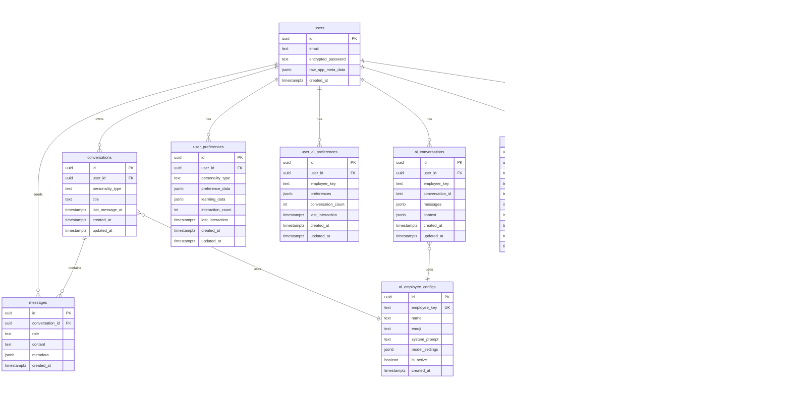

# 🗄️ XspensesAI Chat System - Entity Relationship Diagram

## Current State (Fragmented Schema)

### Tables Overview

**Chat & Conversations**: 4 tables
**Memory & Learning**: 3 tables  
**Employee Config**: 1 table
**Knowledge/RAG**: 3 tables
**Audit/Logs**: 2 tables

**Total**: 13 tables across multiple migrations

---

## Entity Relationship Diagram (Mermaid)



---

## Table Details

### Core Chat Tables

#### conversations
Primary conversation container. Supports both embedded messages (JSONB) and normalized messages.

**Indexes**:
- `idx_conversations_user_id` on `user_id`
- `idx_conversations_personality` on `personality_type`
- `idx_conversations_last_message` on `last_message_at DESC`

**RLS**: Users can only access their own conversations

**Issues**:
- JSONB messages column may grow unbounded
- No pagination support for embedded messages
- Duplicate of `ai_conversations` table

#### messages  
Normalized message storage. Better for querying and pagination.

**Indexes**:
- `idx_messages_conversation_id` on `conversation_id`
- `idx_messages_created_at` on `created_at DESC`
- `idx_messages_role` on `role`

**RLS**: Users can access messages in their conversations only

**Best Practice**: This is the preferred approach

#### ai_conversations
Alternative conversation storage. Appears to be legacy/duplicate.

**Issues**:
- JSONB messages array (same issues as `conversations`)
- Redundant with `conversations` table
- Different employee_key format vs personality_type

**Recommendation**: Migrate to `conversations` + `messages`

### Memory & Learning Tables

#### user_preferences
Per-personality preferences and learning data.

**Contains**:
- `preference_data`: Communication style, favorites
- `learning_data`: Patterns, insights discovered
- `interaction_count`: Engagement metrics

**Indexes**:
- `idx_user_preferences_user_id` on `user_id`
- `idx_user_preferences_personality` on `personality_type`

**Issues**:
- Overlaps with `user_ai_preferences`
- No clear migration path between the two

#### user_ai_preferences
Similar to `user_preferences` but uses `employee_key` instead of `personality_type`.

**Recommendation**: Consolidate into single table

#### user_memory_facts
Long-term facts about users. Can be pinned for inclusion in context.

**Example facts**:
- "User prefers weekly budgets"
- "Has a goal to save $10k by Dec 2025"
- "Dislikes aggressive tone"

**Indexes**:
- `idx_user_memory_facts_user_id` on `user_id`
- `idx_user_memory_facts_pinned` on `is_pinned`

**Good Practice**: Clean separation of durable knowledge

### Employee Configuration

#### ai_employee_configs
Master registry of all AI employees.

**Contains**:
- Base prompts
- Model settings (temperature, max_tokens)
- Active status

**Indexes**:
- `idx_ai_employee_configs_employee_key` on `employee_key UNIQUE`

**Issues**:
- Disconnected from code-based `config/ai-employees.js`
- No versioning for prompt changes
- No A/B testing support

**Recommendation**: Sync with code or make DB source of truth

### Knowledge & RAG Tables

#### documents
Source documents uploaded by users.

**Supported types**:
- Bank statements
- Receipts
- Tax documents
- Contracts

**Features**:
- Checksum-based deduplication
- Versioning support
- Metadata storage (page count, author, etc.)

#### document_chunks
Chunked and embedded document content.

**Chunk Strategy**:
- 500 tokens per chunk
- 50 token overlap
- Structure-aware (preserves sections)

**Vector Index**:
```sql
CREATE INDEX ON document_chunks 
  USING ivfflat (embedding vector_cosine_ops)
  WITH (lists = 100);
```

**Performance**: ~10ms for top-10 similarity search on 10k chunks

#### memory_embeddings
Generic embedding storage for facts, summaries, and user knowledge.

**Supports**:
- `source_type`: 'fact', 'summary', 'insight', 'preference'
- Links back to `user_memory_facts` or other sources

**Uses same vector index as document_chunks**

### Audit & Analytics

#### ai_interactions_log
Comprehensive logging of all AI interactions.

**Metrics Tracked**:
- Processing time (ms)
- Response length (tokens)
- Success/failure
- Error messages

**Indexes**:
- `idx_ai_interactions_log_user_employee` on `(user_id, employee_key)`
- `idx_ai_interactions_log_created_at` on `created_at DESC`

**Use Cases**:
- Performance monitoring
- Cost attribution
- Usage analytics
- Error debugging

---

## Current Issues

### 1. Fragmentation
Multiple tables doing similar things:
- `conversations` vs `ai_conversations`
- `user_preferences` vs `user_ai_preferences`
- `messages` (JSONB) vs `messages` (table)

### 2. Missing Relationships
No foreign keys between:
- `memory_embeddings.source_id` (generic UUID)
- `ai_conversations.employee_key` → `ai_employee_configs.employee_key`

### 3. Naming Inconsistencies
- `personality_type` vs `employee_key` (same concept)
- `conversation_id` (text) vs `id` (uuid)

### 4. No Conversation Summaries Table
Summaries stored inline in JSONB, should be normalized:
```sql
CREATE TABLE conversation_summaries (
  id UUID PRIMARY KEY,
  conversation_id UUID REFERENCES conversations(id),
  summary_text TEXT,
  token_count INT,
  created_at TIMESTAMPTZ
);
```

### 5. Missing Indexes
Several foreign keys lack indexes:
- `messages.conversation_id` (exists)
- `document_chunks.document_id` (missing!)
- `memory_embeddings.source_id` (missing!)

### 6. No Conversation Locking
Race conditions possible on concurrent message inserts.

Need:
```sql
ALTER TABLE conversations ADD COLUMN lock_version INT DEFAULT 0;
```

---

## Recommended Normalized Schema

See `AI_CHAT_SYSTEM_SCHEMA.sql` for complete normalized schema that addresses all issues above.

Key improvements:
- Single `conversations` table
- Separate `messages` table (normalized)
- Unified `user_profiles` (replaces 2 preference tables)
- `conversation_summaries` table
- `employee_profiles` table (replaces config)
- Proper foreign keys and indexes
- Conversation locking
- Vector indexes optimized

---

## Migration Path

### Phase 1: Add Missing Indexes
```sql
CREATE INDEX idx_document_chunks_document_id ON document_chunks(document_id);
CREATE INDEX idx_memory_embeddings_source ON memory_embeddings(source_id, source_type);
```

### Phase 2: Consolidate Preferences
```sql
-- Migrate data
INSERT INTO user_profiles (user_id, employee_slug, ...)
SELECT user_id, personality_type, ...
FROM user_preferences;

-- Drop old table
DROP TABLE user_preferences;
```

### Phase 3: Normalize Conversations
```sql
-- Migrate JSONB messages to table
INSERT INTO messages (conversation_id, role, content, created_at)
SELECT 
  c.id,
  msg->>'role',
  msg->>'content',
  (msg->>'timestamp')::timestamptz
FROM conversations c,
LATERAL jsonb_array_elements(c.messages) AS msg;

-- Remove JSONB column
ALTER TABLE conversations DROP COLUMN messages;
```

### Phase 4: Add Summaries
```sql
CREATE TABLE conversation_summaries (...);

-- Migrate existing summaries from JSONB
INSERT INTO conversation_summaries (...)
SELECT ... FROM conversations WHERE summary IS NOT NULL;
```

### Phase 5: Cleanup
```sql
DROP TABLE ai_conversations;  -- Migrate first
DROP TABLE user_ai_preferences;  -- Consolidated
```

---

## Future Enhancements

### 1. Conversation Branching
Support multiple conversation branches (like ChatGPT):
```sql
ALTER TABLE messages ADD COLUMN parent_message_id UUID REFERENCES messages(id);
ALTER TABLE messages ADD COLUMN branch_name TEXT;
```

### 2. Multi-Employee Conversations
Allow multiple employees in one conversation:
```sql
CREATE TABLE conversation_participants (
  conversation_id UUID REFERENCES conversations(id),
  employee_slug TEXT,
  joined_at TIMESTAMPTZ,
  left_at TIMESTAMPTZ,
  PRIMARY KEY (conversation_id, employee_slug)
);
```

### 3. Message Reactions
User feedback on individual messages:
```sql
CREATE TABLE message_reactions (
  message_id UUID REFERENCES messages(id),
  user_id UUID REFERENCES auth.users(id),
  reaction_type TEXT CHECK (reaction_type IN ('like', 'dislike', 'helpful', 'not_helpful')),
  created_at TIMESTAMPTZ,
  PRIMARY KEY (message_id, user_id)
);
```

### 4. Conversation Templates
Pre-defined conversation starters:
```sql
CREATE TABLE conversation_templates (
  id UUID PRIMARY KEY,
  employee_slug TEXT,
  title TEXT,
  initial_messages JSONB,
  use_count INT DEFAULT 0
);
```

---

**Document End** | See `AI_CHAT_SYSTEM_SCHEMA.sql` for implementation

