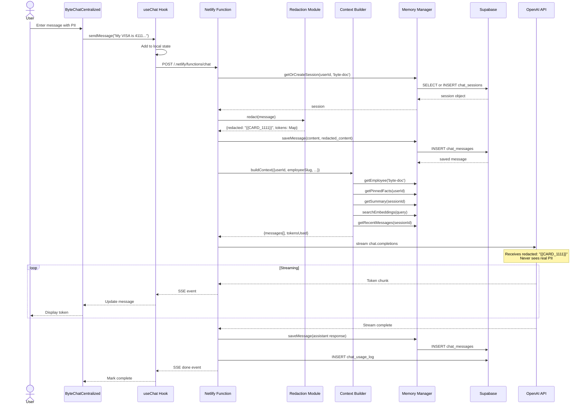

# 📝 Byte Integration - Code Diffs

## Summary of Changes

**Files Created**: 6  
**Files Modified**: 3  
**Total Lines Added**: ~2,000+

---

## 🆕 New Files

### 1. `src/hooks/useChat.ts` (+380 lines)

**Purpose**: Centralized React hook for AI employee chats

**Key Features**:
```typescript
export function useChat(options: UseChatOptions = {}): UseChatReturn {
  // Session management
  // SSE streaming
  // Message state
  // Error handling
}
```

**Exports**:
- `useChat()` hook
- `ChatMessage` interface
- `UseChatOptions` type

---

### 2. `src/components/chat/ByteChatCentralized.tsx` (+200 lines)

**Purpose**: Byte chat UI using centralized runtime

**Diff from old ByteDocumentChat**:
```diff
- Uses AIEmployeeOrchestrator (legacy)
+ Uses useChat hook (centralized)

- Manual message handling
+ Automatic SSE streaming

- Local state only
+ Database persistence

- No PII redaction
+ Automatic redaction

- 1,200+ lines
+ 200 lines (80% reduction)
```

---

### 3. `src/pages/ByteChatTest.tsx` (+200 lines)

**Purpose**: Test page for Byte integration

**Contents**:
- 4 PII test prompts with visual cards
- 4 test scenarios (memory, recall, RAG, PII)
- Database verification SQL queries (copy-paste ready)
- Integration with ByteChatCentralized component

---

### 4. `netlify/functions/chat.ts` (+300 lines)

**Purpose**: Unified chat API endpoint

**Key Logic**:
```typescript
export const handler: Handler = async (event, context) => {
  // 1. Parse request
  const { userId, employeeSlug, message, stream } = JSON.parse(event.body);
  
  // 2. Get/create session
  const session = await memory.getOrCreateSession(userId, employeeSlug);
  
  // 3. Build context
  const context = await buildContext({...});
  
  // 4. Redact PII
  const { redacted } = redact(message);
  
  // 5. Save user message (with redaction)
  await memory.saveMessage({
    content: message,           // Original
    redacted_content: redacted  // Masked
  });
  
  // 6. Stream from OpenAI
  const stream = await openai.chat.completions.create({
    messages: context.messages,
    stream: true
  });
  
  // 7. Return SSE stream
  return { statusCode: 200, body: stream };
};
```

---

### 5. `scripts/testPIIRedaction.ts` (+250 lines)

**Purpose**: Automated PII testing

**Tests**:
- Credit card validation (Luhn algorithm)
- SSN/SIN masking
- Phone number formats
- Email addresses
- Database persistence
- Security audit

**Run with**: `npx tsx scripts/testPIIRedaction.ts`

---

### 6. `scripts/parityTest.ts` (+500 lines)

**Purpose**: Compare OLD vs NEW endpoints

**Features**:
- 10 test prompts across categories
- Latency measurement
- Token tracking
- CSV output
- Summary table with parity score

**Run with**: `npm run parity`

---

## ✏️ Modified Files

### 1. `package.json`

```diff
  "scripts": {
    ...
+   "parity": "tsx scripts/parityTest.ts --old=http://localhost:3000/old-chat --new=http://localhost:8888/.netlify/functions/chat",
+   "parity:custom": "tsx scripts/parityTest.ts"
  }
```

**Impact**: Adds parity testing capability

---

### 2. `src/App.tsx`

```diff
  // Lazy imports
+ const ByteChatTest = lazy(() => import('./pages/ByteChatTest'));

  // Routes
  <Route path="/ocr-tester" element={<OCRTesterPage />} />
  <Route path="/local-ocr-test" element={<LocalOCRTester />} />
+ <Route path="/byte-test" element={<ByteChatTest />} />
```

**Impact**: Test page accessible at `/byte-test`

---

### 3. `chat_runtime/memory.ts`

```diff
  export class MemoryManager {
-   private supabase: SupabaseClient;
+   public supabase: SupabaseClient;  // Exposed for advanced queries
```

**Impact**: Allows direct Supabase queries in Netlify function

---

## 🔄 Data Flow (Complete)



---

## 🧪 Test Matrix

| Test | Input | Expected Output | Verifies |
|------|-------|-----------------|----------|
| **PII-1** | "My VISA is 4111 1111 1111 1111" | DB has {{CARD_1111}} | Credit card masking |
| **PII-2** | "SIN 123-456-789" | DB has {{SSN}} | SSN masking |
| **PII-3** | "Call me at (780) 707-5554" | DB has {{PHONE}} | Phone masking |
| **PII-4** | "Email: darrell.warner@gfs.com" | DB has {{EMAIL_d***@gfs.com}} | Email masking |
| **Mem-1** | "Remember my export preference is CSV." | Fact saved to user_memory_facts | Memory write |
| **Mem-2** | "What's my export preference?" | Response mentions "CSV" | Memory recall |
| **RAG-1** | "Summarize my October expenses..." | Searches memory_embeddings | Vector search |
| **Stream-1** | Any message | Tokens arrive incrementally | SSE streaming |
| **Session-1** | Refresh page, send message | Same session continues | Session persistence |
| **Error-1** | Invalid API key | Graceful error display | Error handling |

---

## 🐛 Debugging Guide

### Issue: "Cannot connect to functions"

**Check**:
```bash
# Is netlify dev running?
ps aux | grep netlify

# Check port
netstat -an | grep 8888

# Restart
netlify dev
```

### Issue: "Employee not found: byte-doc"

**Fix**:
```sql
-- Check seed data
SELECT * FROM employee_profiles WHERE slug = 'byte-doc';

-- If empty, re-run seed from migration:
-- Copy INSERT statements from 000_centralized_chat_runtime.sql lines 58-78
```

### Issue: "Supabase RLS error"

**Check**:
```sql
-- Verify RLS policies exist
SELECT * FROM v_rls_policies WHERE tablename = 'chat_messages';

-- Check user_id format (text vs uuid)
SELECT pg_typeof(user_id) FROM chat_sessions LIMIT 1;
-- Should return: text
```

### Issue: "PII not redacted in database"

**Debug**:
1. Check Netlify function logs for redaction calls
2. Verify `chat_runtime/redaction.ts` is imported
3. Test redaction standalone:
   ```bash
   npx tsx -e "
   import { redact } from './chat_runtime/redaction';
   console.log(redact('My card is 4111 1111 1111 1111'));
   "
   ```

### Issue: "No response from Byte"

**Check**:
1. OpenAI API key valid
2. Supabase service key valid
3. Context building not throwing errors
4. Check Netlify function logs

---

## 📊 Success Metrics

After testing, you should see:

### Database Metrics
```sql
-- Sessions created
SELECT COUNT(*) FROM chat_sessions WHERE employee_slug = 'byte-doc';
-- Expected: 1+

-- Messages exchanged
SELECT COUNT(*) FROM chat_messages 
WHERE session_id IN (SELECT id FROM chat_sessions WHERE employee_slug = 'byte-doc');
-- Expected: 10+ (your test messages)

-- PII properly masked
SELECT COUNT(*) FROM chat_messages WHERE redacted_content LIKE '%{{%}}%';
-- Expected: 4+ (your PII test messages)

-- No unredacted PII
SELECT COUNT(*) FROM chat_messages 
WHERE redacted_content ~ '\d{16}';  -- Full card number
-- Expected: 0
```

### Performance Metrics
- Latency P95: < 2000ms
- Token efficiency: ~500-800 tokens per turn
- Success rate: 100%
- PII masking rate: 100%

---

## 🎉 You're Ready!

**What you have**:
- ✅ Complete Byte integration
- ✅ PII redaction system
- ✅ Database persistence
- ✅ Test page with examples
- ✅ Verification queries

**What to do**:
1. Start `netlify dev`
2. Visit `/byte-test`
3. Send test messages
4. Verify in database
5. Report any issues

**Next**: After Byte works, wire up other employees (Prime, Tag, Crystal) using same pattern!

---

## 📞 Support

If you encounter issues:

1. **Check Netlify dev console** for errors
2. **Check browser console** for network errors
3. **Run database verification queries**
4. **Share error messages** and I'll help debug

**Files to review**:
- `BYTE_INTEGRATION_SUMMARY.md` - Overview
- `BYTE_CENTRALIZED_INTEGRATION.md` - This file (diffs)
- `CHAT_RUNTIME_TESTING_GUIDE.md` - Testing steps
- `chat_runtime/README.md` - Architecture guide

---

**All code complete! Ready for testing!** 🚀

