# Brain Graph - Mermaid Flow Diagrams

**Generated**: 2025-01-06  
**Day 16: Brain & Guardrails Scanner**

---

## Diagram 1: Complete Chat Flow (All Employees)


---

## Diagram 2: Employee Router Decision Tree


---

## Diagram 3: Memory Pipeline Flow

```mermaid
flowchart TD
    UserMessage[User Message] --> MaskPII[maskPII - Redact PII]
    MaskPII --> AssistantResponse[Assistant Response]
    
    AssistantResponse --> ExtractFacts[memory.extractFactsFromMessages]
    ExtractFacts --> FactsArray[Extracted Facts Array]
    
    FactsArray --> FilterFacts{Filter Facts}
    FilterFacts -->|Confidence >= 0.6| ValidFacts[Valid Facts]
    FilterFacts -->|Confidence < 0.6| RejectFacts[Reject Low Confidence]
    
    ValidFacts --> MaskFact[maskPII - Mask Fact Text]
    MaskFact --> UpsertFact[memory.upsertFact - Store Fact]
    UpsertFact --> GenerateEmbedding[memory.embedAndStore - Generate Embedding]
    GenerateEmbedding --> StoreEmbedding[Store in memory_embeddings]
    
    StoreEmbedding --> MemoryComplete[Memory Stored ✅]
    
    style MemoryComplete fill:#90EE90
```



---

## Diagram 4: Guardrails Pipeline Flow

```mermaid
flowchart TD
    Input[Raw User Input] --> InputValidation{Input Valid?}
    InputValidation -->|No| Error[Return Error]
    InputValidation -->|Yes| PIIDetection[maskPII - PII Detection]
    
    PIIDetection --> PIIFound{PII Found?}
    PIIFound -->|Yes| MaskText[Mask PII Text]
    PIIFound -->|No| Continue1[Continue]
    MaskText --> LogPII[logGuardrailEvent - PII]
    LogPII --> Continue1
    
    Continue1 --> ModerationCheck{Moderation Enabled?}
    ModerationCheck -->|Yes| OpenAIModeration[OpenAI Moderation API]
    ModerationCheck -->|No| Continue2[Continue]
    
    OpenAIModeration --> ModerationResult{Flagged?}
    ModerationResult -->|Yes| BlockModeration[Block - Return Error]
    ModerationResult -->|No| LogModeration[logGuardrailEvent - Moderation]
    LogModeration --> Continue2
    
    Continue2 --> JailbreakCheck{Jailbreak Detection Enabled?}
    JailbreakCheck -->|Yes| JailbreakDetection[Jailbreak Detection - GPT-4o-mini]
    JailbreakCheck -->|No| Continue3[Continue]
    
    JailbreakDetection --> JailbreakResult{Detected?}
    JailbreakResult -->|Yes| BlockJailbreak[Block - Return Error]
    JailbreakResult -->|No| LogJailbreak[logGuardrailEvent - Jailbreak]
    LogJailbreak --> Continue3
    
    Continue3 --> GuardrailsPass[✅ Guardrails Passed]
    
    style GuardrailsPass fill:#90EE90
    style BlockModeration fill:#FFB6C1
    style BlockJailbreak fill:#FFB6C1
```



---

## Diagram 5: Header Generation Flow


---

## Diagram 6: Tool Router Flow (Day 16)


---

## Diagram 7: Complete Employee Ecosystem

```mermaid
graph TB
    subgraph "Entry Point"
        ChatEndpoint[/.netlify/functions/chat]
    end
    
    subgraph "Router Layer"
        Router[prime_router.routeTurn]
        Intent[detectIntent]
    end
    
    subgraph "Memory Layer"
        Recall[memory.recall]
        Extract[memory.extractFactsFromMessages]
        Store[memory.embedAndStore]
    end
    
    subgraph "Guardrails Layer"
        PIIMask[maskPII]
        Guardrails[applyGuardrails]
        Logging[logGuardrailEvent]
    end
    
    subgraph "Employee Pool"
        Prime[Prime 👑]
        Crystal[Crystal 🔮]
        Tag[Tag 🏷️]
        Byte[Byte 📄]
        Goalie[Goalie 🥅]
        Automa[Automa ⚙️]
        Blitz[Blitz 💳]
        Liberty[Liberty 🗽]
        Chime[Chime 🔔]
        Roundtable[Roundtable 🎙️]
        Serenity[Serenity 🌸]
        Harmony[Harmony 💚]
        Wave[Wave 🎵]
        Ledger[Ledger 📊]
        Intelia[Intelia 📈]
        Dash[Dash 📉]
        Custodian[Custodian ⚙️]
    end
    
    subgraph "Tool Layer"
        ToolRouter[ToolRouter.runTool]
        Capabilities[CAPABILITIES Map]
        Superbrain[Superbrain Modules]
        GoalTools[Goal Tools]
        DebtTools[Debt Tools]
        TaxTools[Tax Tools]
        AutoTools[Automation Tools]
        BillTools[Bill Tools]
    end
    
    subgraph "Response Layer"
        Headers[buildResponseHeaders]
        JSON[JSON Response]
        SSE[SSE Stream]
    end
    
    ChatEndpoint --> Router
    Router --> Intent
    Intent --> Prime
    Intent --> Crystal
    Intent --> Tag
    Intent --> Byte
    Intent --> Goalie
    Intent --> Automa
    Intent --> Blitz
    Intent --> Liberty
    Intent --> Chime
    Intent --> Roundtable
    Intent --> Serenity
    Intent --> Harmony
    Intent --> Wave
    Intent --> Ledger
    Intent --> Intelia
    Intent --> Dash
    Intent --> Custodian
    
    ChatEndpoint --> PIIMask
    ChatEndpoint --> Guardrails
    ChatEndpoint --> Recall
    ChatEndpoint --> Extract
    ChatEndpoint --> Store
    
    Prime --> ToolRouter
    Crystal --> ToolRouter
    Tag --> ToolRouter
    Byte --> ToolRouter
    Goalie --> ToolRouter
    Automa --> ToolRouter
    Blitz --> ToolRouter
    Ledger --> ToolRouter
    Chime --> ToolRouter
    Serenity --> ToolRouter
    Roundtable --> ToolRouter
    
    ToolRouter --> Capabilities
    Capabilities --> Superbrain
    Capabilities --> GoalTools
    Capabilities --> DebtTools
    Capabilities --> TaxTools
    Capabilities --> AutoTools
    Capabilities --> BillTools
    
    Prime --> Headers
    Crystal --> Headers
    Tag --> Headers
    Byte --> Headers
    Headers --> JSON
    Headers --> SSE
    
    style ChatEndpoint fill:#FFE4B5
    style Router fill:#E0E0E0
    style Headers fill:#90EE90
```

---

**Status**: ✅ All flow diagrams generated for Day 16 brain scan.


