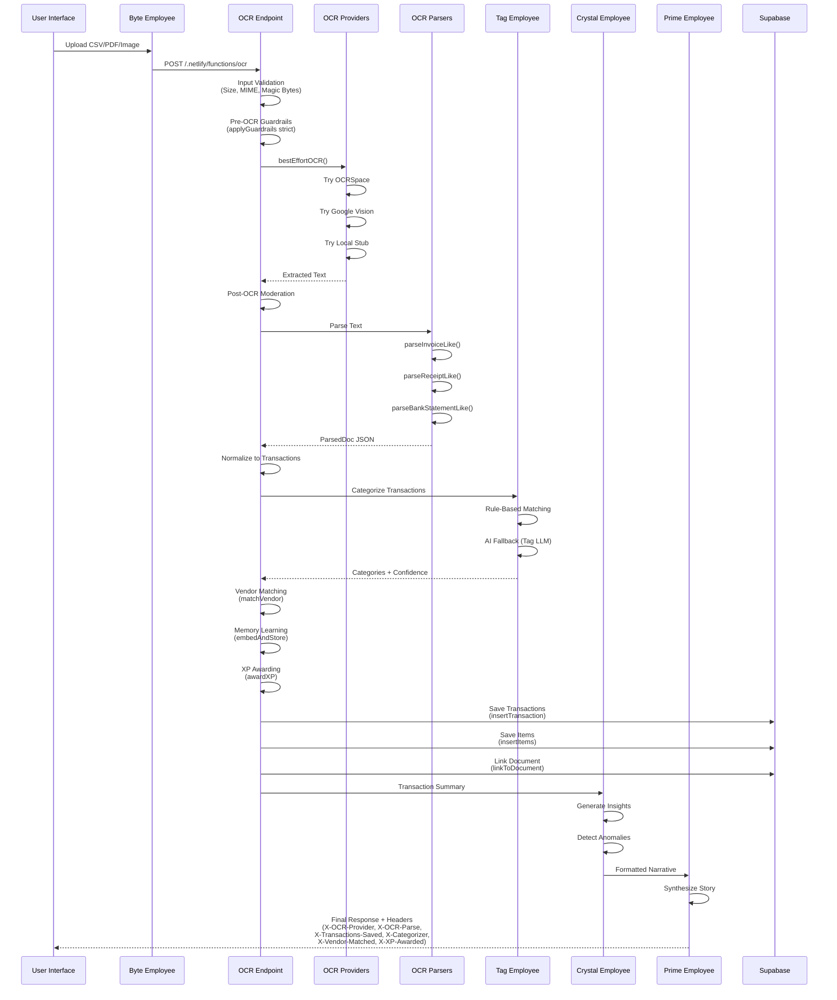
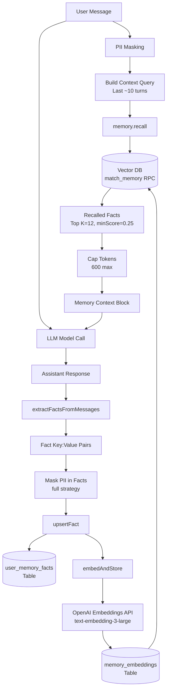
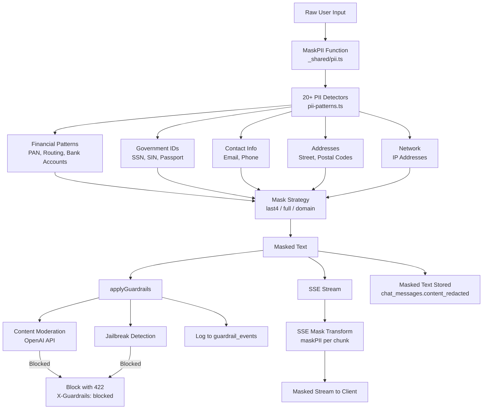
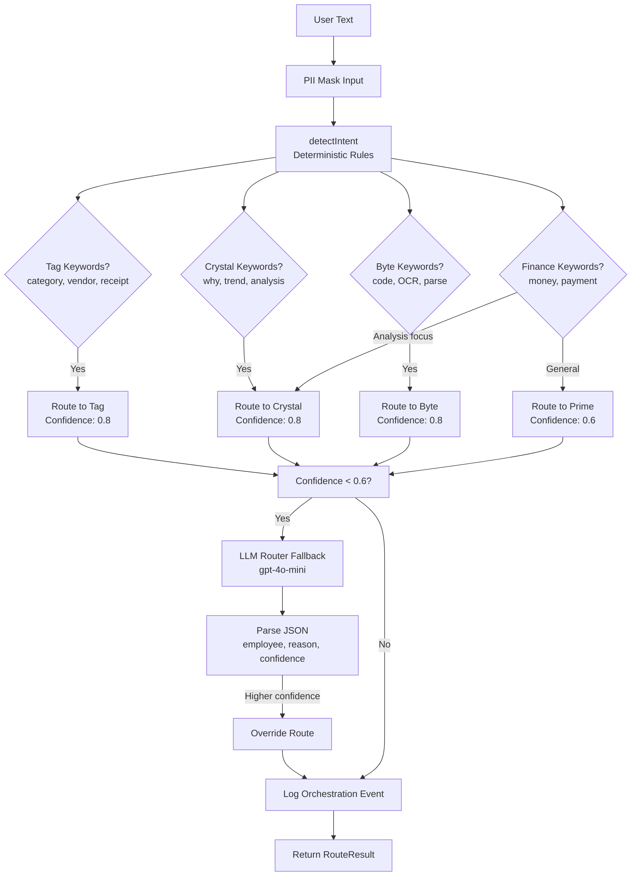

# Brain Map - Mermaid Flow Diagrams

**Generated**: 2025-01-06

---

## Diagram 1: Chat Request Flow (Prime/Crystal/Tag/Byte)

```mermaid
flowchart LR
  UI[Chat Page] --> Hook[usePrimeChat Hook]
  Hook --> ChatFn[/.netlify/functions/chat]
  
  ChatFn --> RateLimit[Rate Limit Check]
  RateLimit --> PIIMask[PII Masking]
  PIIMask --> Guardrails[Guardrails Check]
  Guardrails --> Moderation[OpenAI Moderation]
  
  Moderation --> Session[Session Management]
  Session --> MemoryRecall[Memory Recall]
  MemoryRecall --> SummaryRecall[Session Summary Recall]
  SummaryRecall --> ContextFetch[Context Fetch]
  
  ContextFetch --> Router[prime_router.routeTurn]
  Router -->|Confidence < 0.6| LLMFallback[LLM Router Fallback]
  Router --> EmployeeSelect{Employee Selected}
  
  EmployeeSelect -->|prime| PrimeTools[Prime Tools: delegate]
  EmployeeSelect -->|crystal| CrystalTools[Crystal Tools: delegate]
  EmployeeSelect -->|tag| TagTools[Tag: No tools]
  EmployeeSelect -->|byte| ByteTools[Byte Tools: ocr_file]
  
  PrimeTools --> BuildPrompt[Build System Prompt]
  CrystalTools --> BuildPrompt
  TagTools --> BuildPrompt
  ByteTools --> BuildPrompt
  
  BuildPrompt --> ModelCall[OpenAI API Call]
  ModelCall -->|Tool Calls| ExecuteTools[Execute Tools]
  ExecuteTools --> Synthesis[Synthesis Response]
  ExecuteTools --> ExtractFacts[Extract Facts]
  ExtractFacts --> EmbedStore[Embed & Store]
  
  ModelCall -->|No Tools| DirectResponse[Direct Response]
  DirectResponse --> ExtractFacts
  
  Synthesis --> SaveMessage[Save Message]
  DirectResponse --> SaveMessage
  
  SaveMessage --> BuildHeaders[buildResponseHeaders]
  BuildHeaders --> SSE[SSE Stream Transform]
  SSE --> PIISSE[Mask PII in Stream]
  PIISSE --> UI
  
  SaveMessage --> SummaryGen[Generate Summary if Needed]
  SummaryGen --> EventLog[Log Orchestration Event]
```

---

## Diagram 2: OCR/Bank Ingestion Pipeline (Byte → Tag → Crystal → Prime)



---

## Diagram 3: Memory Pipeline (Recall → Extract → Embed)



---

## Diagram 4: Guardrails & PII Flow



---

## Diagram 5: Router Flow (Deterministic + LLM Fallback)




